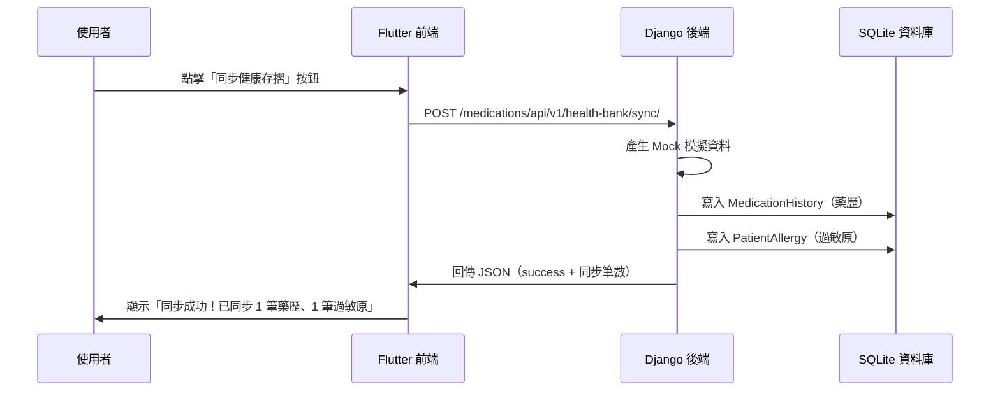

# 健康存摺模擬同步 API 規格書

> 📋 本文件供前端（Flutter）開發人員串接使用

---

## 端點資訊

| 項目 | 內容 |
|---|---|
| **URL** | `/medications/api/v1/health-bank/sync/` |
| **完整路徑** | `http://{伺服器IP}:8000/medications/api/v1/health-bank/sync/` |
| **HTTP 方法** | `POST` |
| **Content-Type** | `application/json` |
| **必要參數** | `user_id`（整數）：當前登入使用者的 ID |

---

## 請求說明（Request）

前端呼叫此 API 時，**必須傳入 `user_id`**，以便後端將同步回來的藥歷與過敏原精準綁定到該病患名下，後續才能進行用藥安全檢查。

### 傳入方式（擇一即可）：

#### 方式一：JSON Body（推薦）
```json
{
  "user_id": 1
}
```

#### 方式二：URL Query 參數
```http
POST /medications/api/v1/health-bank/sync/?user_id=1
```

---

### Flutter 呼叫範例
```dart
final response = await http.post(
  Uri.parse('$API_BASE_URL/medications/api/v1/health-bank/sync/'),
  headers: {'Content-Type': 'application/json'},
  body: jsonEncode({
    'user_id': currentUserId, // 當前登入的使用者 ID
  }),
);
```

#### cURL 呼叫範例
```bash
curl -X POST http://127.0.0.1:8000/medications/api/v1/health-bank/sync/
```

---

### 🔹 未來正式版本（串接真實健康存摺 SDK 後）

未來若串接真實健保署 SDK，前端可能需要傳送使用者授權 Token：

```json
{
  "user_id": 2,
  "health_bank_token": "使用者透過健保快易通授權後取得的 Token"
}
```

> [!NOTE]
> 此格式為預留規劃，目前 Mock 版本尚未實作，前端暫時不需要處理。

---

## 回應說明（Response）

### ✅ 成功回應（HTTP 200）

```json
{
  "status": "success",
  "message": "已成功自健保署健康存摺同步歷史藥歷與過敏原！",
  "synced_medications": 1,
  "synced_allergies": 1
}
```

| 欄位 | 型態 | 說明 |
|---|---|---|
| `status` | String | 回應狀態，成功為 `"success"` |
| `message` | String | 人類可讀的說明訊息 |
| `synced_medications` | Integer | 本次同步的藥歷紀錄筆數 |
| `synced_allergies` | Integer | 本次同步的過敏原紀錄筆數 |

---

### ❌ 錯誤回應

#### 使用了錯誤的 HTTP 方法（HTTP 405）

```json
{
  "status": "error",
  "message": "僅支援 POST 請求"
}
```

---

## Mock 模擬資料內容

後端目前會自動產生以下固定的模擬資料並存入資料庫：

### 模擬藥歷紀錄（1 筆）

| 欄位 | 模擬值 |
|---|---|
| 醫療院所 | 國泰綜合醫院 |
| 處方日期 | 2026-08-20 |
| 健保藥品代碼 | BC24512100 |
| 藥品名稱 | Candesartan |
| 劑量 | 8mg |
| 頻率 | QD（每日一次） |
| 天數 | 28 天 |
| 適應症 | 降血壓 |

### 模擬過敏紀錄（1 筆）

| 欄位 | 模擬值 |
|---|---|
| 過敏原名稱 | Amoxicillin |
| 過敏反應 | 皮膚紅疹、搔癢 |
| 發現日期 | 2024-05-10 |

---

## 前端串接流程



---

## 重要備註

> [!IMPORTANT]
> - 此 API 為**冪等操作**（Idempotent）：重複呼叫不會產生重複資料，後端使用 `update_or_create` 機制，相同的 `drug_code` 或 `allergen_name` 只會更新不會新增。
> - 目前 Mock 模式下，不管哪個使用者呼叫，都會拿到同一組假資料。
> - 未來串接真實 SDK 時，只需要修改後端的 `health_bank.py`，將 `mock_sdk_payload` 替換為真實 API 回傳的資料即可，**前端呼叫方式不需要改變**。
