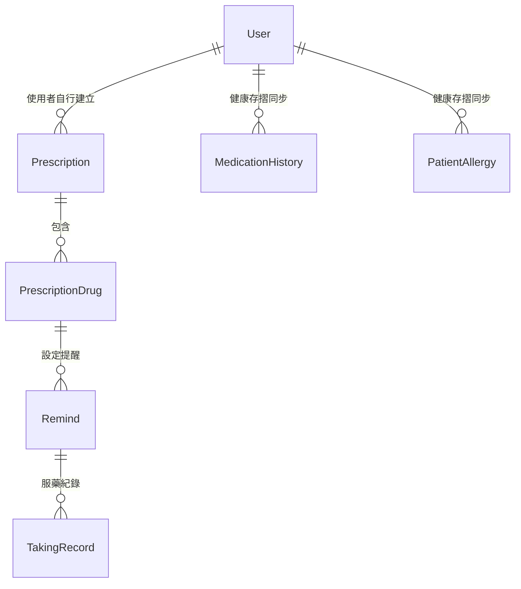

# 健康存摺同步 - 資料表欄位規格

## 資料表一：MedicationHistory（健康存摺藥歷紀錄）

> 用途：儲存從健保署健康存摺同步回來的**歷史用藥紀錄**，與使用者自行掃描建立的藥單（Prescription）分開管理。

| 欄位名稱 | 資料型態 | 說明 | 範例值 |
|---|---|---|---|
| `history_id` | AutoField (PK) | 主鍵，自動遞增 | 1, 2, 3... |
| `user` | ForeignKey → User | 關聯使用者（可為空，未登入時為 NULL） | User #2 |
| `drug_code` | CharField(50) | 健保藥品代碼 | `BC24512100` |
| `drug_name` | CharField(255) | 藥品名稱 | `Candesartan` |
| `dosage` | CharField(50) | 劑量 | `8mg` |
| `frequency` | CharField(50) | 服藥頻率 | `QD`（每日一次）、`BID`（每日兩次）、`TID`（每日三次） |
| `days` | IntegerField | 給藥天數 | `28` |
| `hosp_name` | CharField(100) | 開立處方的醫療院所名稱 | `國泰綜合醫院` |
| `rx_date` | DateField | 處方開立日期 | `2026-08-20` |
| `synced_at` | DateTimeField | 資料同步時間（自動記錄建立時間） | `2026-09-18 22:30:00` |

---

## 資料表二：PatientAllergy（患者過敏原紀錄）

> 用途：儲存從健保署健康存摺同步回來的**藥物過敏紀錄**，採結構化設計，每筆過敏原獨立存放，便於後續進行用藥安全交叉比對。

| 欄位名稱 | 資料型態 | 說明 | 範例值 |
|---|---|---|---|
| `allergy_id` | AutoField (PK) | 主鍵，自動遞增 | 1, 2, 3... |
| `user` | ForeignKey → User | 關聯使用者（可為空，未登入時為 NULL） | User #2 |
| `allergen_name` | CharField(255) | 過敏原名稱（通常為藥品學名） | `Amoxicillin` |
| `reaction` | TextField | 過敏反應描述（可為空） | `皮膚紅疹、搔癢` |
| `synced_at` | DateTimeField | 資料同步時間（自動記錄建立時間） | `2026-09-18 22:30:00` |

---

## 與現有資料表的關係

| 資料來源 | 資料表 | 說明 |
|---|---|---|
| 使用者自行操作 | `Prescription` + `PrescriptionDrug` | 使用者透過 APP 掃描藥單或手動輸入的**當前正在服用的藥品** |
| 健康存摺同步 | `MedicationHistory` | 從健保署同步回來的**過去就醫用藥歷史紀錄** |
| 健康存摺同步 | `PatientAllergy` | 從健保署同步回來的**結構化藥物過敏紀錄** |
